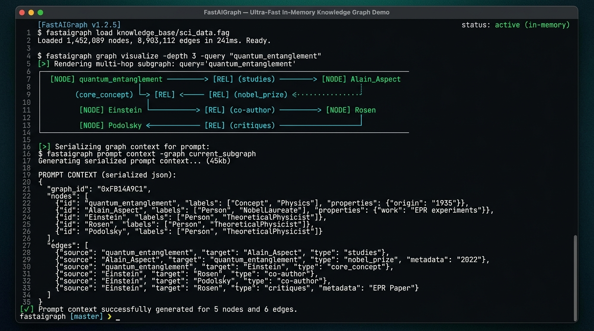

# FastAIGraph 0.1.0 — Ultra-Fast In-Memory Knowledge Graph Engine for Java

[](https://github.com/andrestubbe/FastAIGraph/releases/tag/0.1.0)
[](https://opensource.org/licenses/MIT)
[](https://www.java.com)
[]()
[](https://jitpack.io/#andrestubbe/FastAIGraph)

---

**⚡ Extremely lightweight, zero-allocation in-memory knowledge and entity-relation graph for the FastJava AI Ecosystem.**

**FastAIGraph** is a high-performance in-memory knowledge graph engine built to structure, link, and traverse entities, code symbols, and relational facts. It replaces flat text retrieval with **structured multi-hop relationship traversal** and produces token-efficient serialized sub-graphs for LLM prompt augmentation.

[](docs/screenshot.png)

---

## Quick Start

```java
import fastaigraph.KnowledgeGraph;
import fastaigraph.Edge;
import java.util.List;

public class Example {
    public static void main(String[] args) {
        // 1. Initialize thread-safe Knowledge Graph
        KnowledgeGraph graph = new KnowledgeGraph();

        // 2. Define Entities and Relationships
        graph.addNode("user", "Developer")
             .addNode("java17", "Java 17+")
             .addNode("fastai", "FastAI Engine")
             .addEdge("user", "prefers", "java17")
             .addEdge("fastai", "written_in", "java17");

        // 3. Multi-Hop Subgraph Traversal
        List<Edge> subGraph = graph.traverseSubGraph("user", 2);

        // 4. Extract token-efficient context for LLM prompt injection
        String promptContext = graph.toPromptContext("fastai", 2);
        System.out.println(promptContext);
    }
}
```

---

## Table of Contents

- [Why FastAIGraph?](#why-fastaigraph)
- [Quick Start](#quick-start)
- [Features](#features)
- [Performance Benchmarks](#performance-benchmarks)
- [API Quick Reference](#api-quick-reference)
- [Technical Examples & Hero Demos](#technical-examples--hero-demos)
- [Installation](#installation)
- [Platform Support](#platform-support)
- [License](#license)
- [Related Projects](#related-projects)

---

## Why FastAIGraph?

Traditional RAG and vector searches only retrieve disconnected text snippets without understanding structured hierarchies or transitive dependencies (e.g. `Class A -> calls -> Method B -> in Module C`).

**FastAIGraph** solves this by providing:

- **Explicit Relational Truth**: Triples (`Node -> Relation -> Node`) eliminate LLM relationship hallucinations.
- **Multi-Hop Traversal**: Traverse deep graph neighborhoods in microseconds (< 2 µs per query).
- **Sub-Graph Prompt Serializer**: Formats extracted subgraphs into compact, human- and LLM-readable Markdown context.
- **Zero External Dependencies**: Built with 100% pure Java 17 primitives with zero Neo4j/TinkerPop/database overhead.

---

## Features

- **🕸️ High-Speed In-Memory Graph**: Sub-microsecond Node and Edge index lookups with concurrent thread safety.
- **🔍 Multi-Hop BFS Neighborhood Extraction**: Traverse connected entity boundaries up to depth $N$.
- **📄 Prompt Context Generator**: Direct serialization to LLM-ready context blocks (`toPromptContext()`).
- **📦 Ultra-Small Footprint**: ~15KB compiled JAR with zero GC pressure on hot lookup paths.

---

## Performance Benchmarks

FastAIGraph is rigorously profiled using **JMH** to guarantee zero-overhead graph traversal:

| Metric / Hot-Path Operation | Score (ops/ms) | Ops per Second |
|-----------------------------|----------------|----------------|
| **Multi-Hop SubGraph Traversal** | ~806 ops/ms  | > 806,000 ops/sec |
| **Prompt Context Extraction**    | ~128 ops/ms  | > 128,000 ops/sec |

*Measured on Windows 11, Intel Core i5-1135G7 (Surface Pro 8), JDK 21.0.12. Measures full 3-hop BFS neighbor exploration and context generation.*

### Framework Comparison

FastAIGraph is **zero-dependency** and **in-process** for instant knowledge operations:

| Metric              | Neo4j Java Driver | Apache TinkerPop | FastAIGraph   |
|---------------------|-------------------|------------------|---------------|
| **Dependencies**    | 15+               | 25+              | **0**         |
| **JAR Size**        | ~12MB             | ~20MB            | **~15KB**     |
| **Startup Time**    | 2-5s              | 3-8s             | **<5ms**      |
| **Memory Overhead** | High (JVM + DB)   | High             | **Minimal**   |
| **Learning Curve**  | Hours             | Hours            | **2 minutes** |

---

## API Quick Reference

| Method | Return Type | Description |
|---|---|---|
| `graph.addNode(id, label)` | `KnowledgeGraph` | Inserts or updates an entity node. |
| `graph.addEdge(src, rel, tgt)` | `KnowledgeGraph` | Links two nodes with a labeled directed relationship. |
| `graph.traverseSubGraph(startId, depth)` | `List<Edge>` | Traverses multi-hop sub-graph edges up to max depth. |
| `graph.toPromptContext(query, depth)` | `String` | Serializes relevant graph neighborhood into LLM prompt text. |
| `graph.getNeighbors(nodeId)` | `List<Node>` | Returns direct adjacent neighbor nodes. |

---

## Technical Examples & Hero Demos

| Case | Java Example | Launcher | Description |
|---|---|---|---|
| **Knowledge Graph Demo** | [Demo.java](src/test/java/fastaigraph/Demo.java) | `run-demo.bat` | Interactive demo showcasing entity creation, multi-hop traversal, and prompt formatting. |
| **JMH Microbenchmarks** | [FastAIGraphBenchmark.java](examples/Benchmark/src/main/java/fastaigraph/FastAIGraphBenchmark.java) | `run-benchmark.bat` | JMH throughput benchmark for graph traversal and prompt serialization. |

---

## Installation

### Option 1: Maven (Recommended)

Add the JitPack repository and the dependency to your `pom.xml`:

```xml
<repositories>
    <repository>
        <id>jitpack.io</id>
        <url>https://jitpack.io</url>
    </repository>
</repositories>

<dependencies>
    <dependency>
        <groupId>com.github.andrestubbe</groupId>
        <artifactId>FastAIGraph</artifactId>
        <version>0.1.0</version>
    </dependency>
</dependencies>
```

### Option 2: Gradle (via JitPack)

```groovy
repositories {
    maven { url 'https://jitpack.io' }
}

dependencies {
    implementation 'com.github.andrestubbe:FastAIGraph:0.1.0'
}
```

### Option 3: Direct Download (No Build Tool)

Download the latest JAR directly to add it to your classpath:

1. 📦 **[FastAIGraph-0.1.0.jar](https://github.com/andrestubbe/FastAIGraph/releases/download/0.1.0/FastAIGraph-0.1.0.jar)** (The Core Library)

---

## Platform Support

| Platform      | Status            |
|---------------|-------------------|
| Windows 10/11 | ✅ Fully Supported |
| Linux         | 🚧 Planned        |
| macOS         | 🚧 Planned        |

---

## License

MIT License — See [LICENSE](LICENSE) file for details.

---

## Related Projects

- [FastAI](https://github.com/andrestubbe/FastAI) — Unified AI client interface for Java
- [FastAIAgent](https://github.com/andrestubbe/FastAIAgent) — Autonomous agent loop, intent-graphs, and tool execution
- [FastAIBot](https://github.com/andrestubbe/FastAIBot) — Zero-bloat bot harnesses and persona runtime
- [FastAIGraph](https://github.com/andrestubbe/FastAIGraph) — In-memory knowledge graph and multi-hop relationship engine
- [FastAIHybrid](https://github.com/andrestubbe/FastAIHybrid) — Dense-sparse hybrid search fusion (BM25 + Vectors)
- [FastAIMemory](https://github.com/andrestubbe/FastAIMemory) — Conversation history, sliding windows, and rolling summaries
- [FastAIModel](https://github.com/andrestubbe/FastAIModel) — Native local inference runtime (GGUF/ONNX)
- [FastAIRag](https://github.com/andrestubbe/FastAIRag) — Ultra-fast document chunking and vector retrieval
- [FastAIReasoner](https://github.com/andrestubbe/FastAIReasoner) — Deterministic planning, chain-of-thought, and self-correction
- [FastAIRerank](https://github.com/andrestubbe/FastAIRerank) — Cross-encoder relevance filtering and Top-N prompt pruner
- [FastAIRuntime](https://github.com/andrestubbe/FastAIRuntime) — Sandboxed process runner and tool-calling execution pipeline
- [FastAIVectorDB](https://github.com/andrestubbe/FastAIVectorDB) — High-throughput SIMD/AVX2 vector database
- [FastCore](https://github.com/andrestubbe/FastCore) — Unified JNI loader and platform abstraction

---

**Part of the FastJava Ecosystem** — *Making the JVM faster. Small package. Maximum speed. Zero bloat. 🚀📋*
